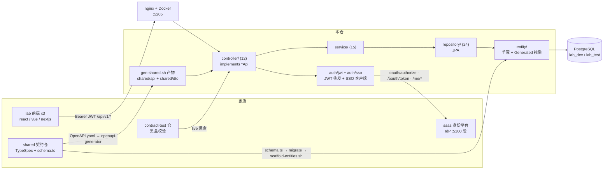
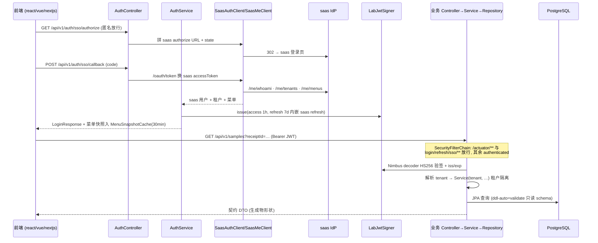

# lab-management-system-springboot 架构

> 一句话定位：lab-management-system 多仓家族的 Java 后端实现（端口 5205）——同一份 shared TypeSpec 契约 + 同一个 PostgreSQL schema，与 aspnetcore/nextjs 后端对称实现「前端不可区分」的 API 面，由 lab-management-system-contract-test 黑盒校验。

生成日期：2026-09-22 ｜ 锚定 HEAD：0dd260d ｜ 生成方式：DeepWiki 风格架构扫描

## 1. 总览

- **家族角色**：后端仓（6 角色中的「后端」）。产品契约真源在 `../lab-management-system-shared`（TypeSpec → OpenAPI.yaml；DB schema 真源 = shared `src/db/schema.ts`），本仓消费生成物 + 手写业务层。
- **技术栈**：Java 21 + Spring Boot 3.4.1 + Maven + Spring Data JPA（`ddl-auto=validate`）+ Spring Security OAuth2 Resource Server（JWT）+ PostgreSQL 驱动 + JUnit 5。版本钉死于 `version-lock.json`（java 21 / spring-boot 3.4.1 / maven 3.9+）。格式与静态检查 = Spotless（google-java-format 1.25.2）+ SpotBugs（4.9.3.2, effort=Max/threshold=Low）。
- **规模速览**（统计自 HEAD 工作树）：
  - `src/main/java` 合计约 51,900 行，其中 codegen 产物 `io/xr/lab/shared`（13 个 Api 接口 + 140 个 DTO，共 154 文件）约 36,300 行，手写 `io/xr/lab/platform` 约 15,600 行
  - 端点：13 个生成的 `*Api` 接口共 119 个 `@RequestMapping` 端点，由 12 个 `@RestController` 实现
  - 手写侧：15 个 Service、24 个 Repository、12 个 Mapper、25 个手写 entity + 34 个 `entity/Generated/` 镜像 + 18 个枚举 Converter
  - 测试：`src/test/java` 24 个文件（Service 单测为主 + `RepositoryPgTest` 真 PG 集成 + MockWebServer 拉 saas 替身 + harness trace 监听器）
- **双身份**：书稿配套仓（代码块 source of truth）+ harness 门禁仓。另有更详细的 `docs/ARCHITECTURE.md`（阅读路径 + 同步协议细则），本文是 DeepWiki 风格速览。

## 2. 系统架构

关键边界：

1. **API 面只认生成物**——`io/xr/lab/shared/api` + `dto` 全部来自 `scripts/gen-shared.sh`（openapi-generator 7.24.0，spring interfaceOnly），手写 Controller `implements *Api` 拿到编译期契约锁。
2. **DB schema 不归本仓**——Flyway 已随 ADR-0033 退役；本仓 `ddl-auto=validate` 只校验不迁移，schema 演进走 shared 仓 DB-First。
3. **身份链外挂 saas**——本仓签发 lab JWT（HS256），但用户/租户/菜单真值来自 saas IdP；菜单快照在 SSO/refresh 时点抓取并进程内缓存。
4. **对前端与 contract-test 完全同面**——三前端 + contract-test 打的都是同一份契约端点，本仓不做任何前端特判。

## 3. 模块分解

| 模块/目录 | 职责 | 关键文件 |
|---|---|---|
| `src/main/java/io/xr/harness` | Spring Boot 入口；显式扫 `io.xr.harness` + `io.xr.lab` 双包（漏扫会静默回退 Basic 401 链） | `Application.java` |
| `platform/controller` | 12 个薄控制器，implements 生成的 `*Api`，禁止业务逻辑 | `SampleController`（M03.F03）、`InspectionCatalogController`（含 tenant 解析静态助手）、`AuthController` |
| `platform/service` | 手写业务核心：合同、样品/收样、报告流程（审核/批准/发放/归档）、字典/目录/连接表、汇总、计算方法 | `AuthService`、`ReportFlowService`、`SampleReceiptService`、`InspectionJunctionService`、`SummaryService` |
| `platform/auth/jwt` | HS256 真签名 JWT 签发/验签（access 1h / refresh 7d，refresh 内嵌 saas refresh token）；Nimbus decoder | `LabJwtSigner`、`NimbusLabJwtDecoderFactory`（覆盖原 DevJwtDecoder 的 alg=none 直通漏洞） |
| `platform/auth/sso` | 对 saas 的 HTTP 客户端 + 快照缓存（TTL 30min 进程内） | `SaasAuthClient`（authorize/token）、`SaasMeClient`（whoami/tenants/menus）、`SaasMenuMapper`、`MenuSnapshotCache`、`MembershipSnapshotCache` |
| `platform/config` | 安全链、CORS、全局异常、fail-fast 配置 | `SecurityConfig`、`SsoBeansConfig`（凭据缺失 ISE）、`GlobalExceptionHandler`、`LabConfig` |
| `platform/directory` | 配置式用户/租户目录（dev demo 目录，1:1 镜像 lab-msw seed；SSO 用户运行时 upsert） | `ConfigUserDirectory`、`UserDirectory` |
| `platform/entity` | 手写 JPA entity（业务枚举 `@Convert`）+ `Generated/` 纯 POJO 镜像（入 git，git diff 漂移检测） | `ContractEntity`、`Generated/SampleReceipts` 等 34 个 |
| `platform/repository` | 24 个 Spring Data JPA repository | `ContractRepository`、`SampleReceiptRepository` 等 |
| `platform/mapper` | DTO ↔ entity 映射层（10 个） | `SampleMapper`、`ContractMapper` 等 |
| `io/xr/lab/shared` | **codegen 产物，不手改**：13 个 Api 接口 + 140 个 DTO | `AuthApi`（9 端点）、`InspectionDictionaryApi`（28 端点）等 |
| `src/main/resources` | 配置 + 前端绑定锚点 | `application.yml`、`frontend-bind.md`（`@entry M05.F01.I01`，供 L5 引用门识别 UI 入口在前端仓） |
| `scripts` | 契约/DB 同步脚本 | `gen-shared.sh`、`scaffold-entities.sh` + `.mjs` |
| `deploy` + `Dockerfile` | 生产部署 | `deploy/lab-management-system-springboot.sh`、`nginx-vps.conf.example` |

## 4. 数据流 / 请求生命周期

代表性链路：**SSO 登录换取 lab JWT → 带 Bearer 的业务 CRUD**。

要点：CSRF 用 RFC 6749 §10.12 标准 state（前端生成、后端透传、前端比对）；密码登录（alice/dev123456）走 `ConfigUserDirectory` demo 目录，菜单 miss 时回退静态 demo 菜单。

## 5. 依赖面

- **对 shared 契约仓（`../lab-management-system-shared`）**：
  - API 面：`gen-shared.sh` 两步——shared `npm run emit:openapi` → openapi-generator（7.24.0，interfaceOnly + useSpringBoot3 + hideGenerationTimestamp）产 `io/xr/lab/shared/{api,dto}`；末端两个已知生成器缺陷 sed 修补（AuthState `getKind()` 删除、`UpdateSampleExtRequest.ext` 初始化器剥离 + 失配 exit 3）；收尾 `spotless:apply` + 写 `.state/last-gen-shared.json`（ADR-0026 marker，同 sha 零写入）。
  - DB 面：`scaffold-entities.sh`——node 直读真库 `information_schema` 反推 `entity/Generated/`，随后 `git diff` + untracked 双检，不一致 exit 1（漂移防线 = 镜像 diff + `ddl-auto=validate` 双层）。
- **对家族其他仓**：依赖 saas-nextjs IdP（`LAB_SAAS_BASE_URL`/`LAB_SSO_LOGIN_URL` 指向 :5100 段）；三前端与 contract-test 以契约端点为本仓唯一消费面；端口 5205（家族 lab=5200 段）；与 nextjs 后端共用一个库（可经 `DATABASE_URL` 切走）。
- **外部依赖**：PostgreSQL（lab_dev/lab_test 三库分层）；saas IdP（OAuth code 流 + 服务账号密码登录拉菜单，`LAB_SAAS_SERVICE_USER/PASSWORD/CLIENT_ID`）。

## 6. 配置与部署

env 变量（application.yml 占位 + ADR-0019 fail-fast，缺失即 throw，无 demo 字面兜底）：

| key | 用途 | 缺失时行为 |
|---|---|---|
| `SERVER_PORT` | 监听端口（家族约定 5205） | Spring 绑定空串 → 启动失败（fail-fast） |
| `DATABASE_URL`（兜底 `JDBC_URL`） | PG 连接串 | 空串注入 → 连接失败（SsoBeansConfig `@PostConstruct` 校验数据源缺失 throw） |
| `DATABASE_USER` / `DATABASE_PASSWORD` | PG 凭据 | 同上 |
| `JWT_ISSUER` / `JWT_TTL_SECONDS` / `JWT_REFRESH_TTL_SECONDS` | JWT 签发参数 | 缺失 throw（ADR-0019 删字面默认值） |
| `JWT_SIGNING_KEY` | HS256 密钥（≥32B） | 弱/缺 → 构造器 ISE 阻断 bean 创建 |
| `LAB_SAAS_BASE_URL` / `LAB_SSO_LOGIN_URL` / `LAB_SAAS_CLIENT_ID` / `LAB_SAAS_CLIENT_SECRET` / `LAB_SAAS_DEFAULT_TENANT_ID` | SSO 四件套 + 登录页 | SsoBeansConfig 构造器 ISE fail-fast |
| `LAB_SAAS_SERVICE_USER` / `LAB_SAAS_SERVICE_PASSWORD` / `LAB_SAAS_SERVICE_CLIENT_ID` | 服务账号（拉菜单快照） | 同上 |
| `LAB_SSO_CALLBACK_REDIRECT` | SSO 回跳 base | 同上 |
| `LAB_AUTH_DEV_PASSWORD` | dev 密码登录口令覆盖 | 待补充（`ConfigUserDirectory` 有默认 demo 口令） |
| `LAB_CORS_ALLOWED_ORIGINS` | CORS origin 白名单 CSV（allowCredentials=true） | 空白名单 → 跨源被拦 |

部署：两阶段 Dockerfile（`maven:3.9-eclipse-temurin-21` 构建 fat jar `lab-management-system-springboot-0.1.0-SNAPSHOT.jar` → `eclipse-temurin:21-jre-jammy` 运行），容器内监听 5205，`HEALTHCHECK` wget `/actuator/health`（SecurityConfig 已 permitAll `/actuator/**`）。VPS 侧 `deploy/lab-management-system-springboot.sh`（CI deploy job 远程调用，支持 tag 回滚）+ `nginx-vps.conf.example`（域名 `lab-springboot.xiangru.uk` 反代 127.0.0.1:5205，ADR-0018 单层端口）。放行纪律：全量回归绿后打 `v<MAJOR>.<MINOR>.<PATCH>-<YYYYMMDD>` tag。

## 7. 质量门禁

来自 `.harness/stack.json`（suite `python scripts/gate.py -p lab-management-system-springboot`）：

| 门 | 名称 | 命令 |
|---|---|---|
| L1 | 格式 | `mvn -q spotless:check`（修复：`mvn spotless:apply`） |
| L2 | 静态检查 | `mvn -q spotbugs:check`（exclusion：`spotbugs-exclude.xml`） |
| L3 | 编译 | `mvn -q -DskipTests compile` |
| L4 | 测试 | `mvn -q test` |

trace 采集：`mvn -q test -Dharness.trace=true`（`io/xr/harness/junit/HarnessTraceListener` 经 SPI 挂载，产出 `.state/trace.json` 功能 ID 覆盖）。exit code 语义：0 = 通过；1 = 回代码修；2 = 契约/环境问题，停下问人。
