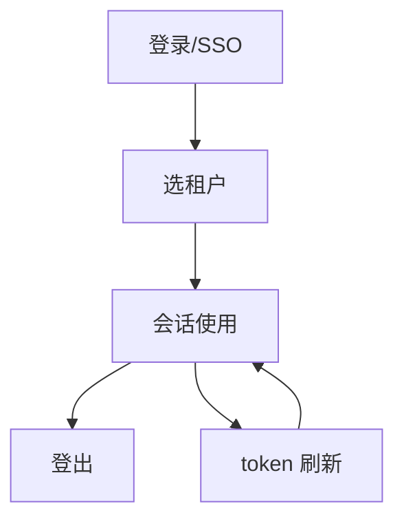
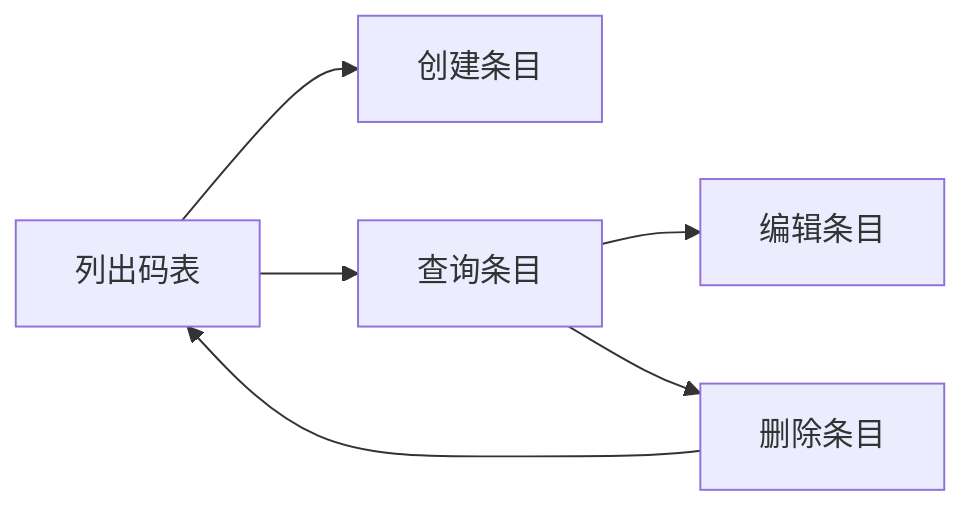
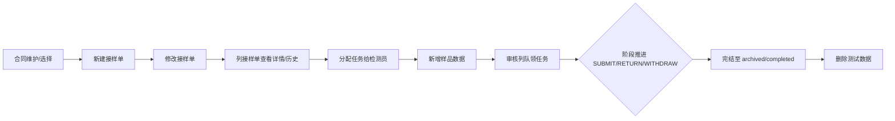
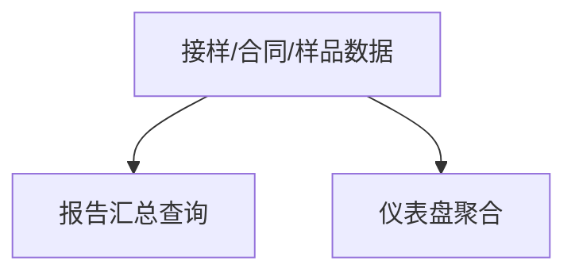

# 流程与功能对齐 — 建筑工程实验室管理系统SpringBoot后端

> 人填、人评审。机器只检查引用的功能 ID 是否存在。
> 评审时把流程图投出来，逐行念「这一步靠哪些功能完成」。念不出来的行，
> 要么流程是空的，要么功能是缺的。这就是对齐的全部意义。

## FLOW-01 认证与会话（B1）

| 步骤 | 名称 | 角色 | 输入 | 输出 | 状态流转 | 支撑功能子项 |
|---|---|---|---|---|---|---|
| S01 | 登录（密码或 SSO 跳 saas） | 所有用户 | username/password 或 sso code | access/refresh token + 租户列表 | anonymous -> awaiting_tenant | M01.F05.I01, M01.F05.I02, M01.F05.I03 |
| S02 | 选租户换发 token | 所有用户 | tenantId | 携带 tenant_id claim 的新 token | awaiting_tenant -> authenticated | M00.F02.I01 |
| S03 | 会话使用（me/菜单/权限） | 所有用户 | Bearer token | user + tenants + currentTenantId / 菜单树 / 权限集 | authenticated | M00.F01.I01, M01.F04.I01, M01.F04.I02 |
| S04 | 登出 | 所有用户 | Bearer token | 204 | authenticated -> anonymous | M01.F05.I05 |
| S05 | token 刷新 | 所有用户 | refreshToken | 新 access token | authenticated（续期） | M01.F05.I04 |

### 评审时问这四个问题

1. 有没有哪个步骤的「支撑功能子项」是空的？→ 功能缺失，或这一步不该存在
2. 有没有功能子项从头到尾没出现在任何流程里？→ 见下方孤儿清单
3. 状态流转列里的状态名，和代码里的枚举一致吗？→ 不一致就是两套真相
4. 退回路径都画了吗？→ 只画正向流程，会漏掉一半功能

## FLOW-02 字典维护（B2：M04 基础数据 + M06 计算方法/技术要求）

> 「字典维护」是 M04/M06 子模块的批量录入/查询/编辑流程；
> 真实业务系统的试验流程（M03 业务链路）尚未落地，本批次只登记数据维护闭环。

| 步骤 | 名称 | 角色 | 输入 | 输出 | 状态流转 | 支撑功能子项 |
|---|---|---|---|---|---|---|
| S01 | 列出码表 | 配置员 | 4 过滤（object / keyword） | Model/Spec/Grade/Brand[] | — | M04.F06.I01, M04.F07.I01, M04.F08.I01, M04.F09.I01 |
| S02 | 创建条目 | 配置员 | 表单（code / name + 可选 object / remark / sortOrder） | 新增行 | — | M04.F06.I02, M04.F07.I02, M04.F08.I02, M04.F09.I02 |
| S03 | 查询条目 | 配置员 | 4 过滤（object / parameter / standard / status） | CalculationMethod[] / TechnicalRequirement[] | — | M06.F05.I01, M06.F06.I01 |
| S04 | 编辑条目 | 配置员 | PATCH 表单 | 更新后行 | — | M04.F06.I03, M04.F07.I03, M04.F08.I03, M04.F09.I03, M06.F05.I04, M06.F06.I04 |
| S05 | 删除条目 | 配置员 | code | 204 | — | M04.F06.I04, M04.F07.I04, M04.F08.I04, M04.F09.I04, M06.F05.I05, M06.F06.I05 |

### 评审时问这四个问题（FLOW-02）

1. 有没有哪个步骤的「支撑功能子项」是空的？→ 功能缺失。
2. 有没有功能子项从头到尾没出现在任何流程里？→ M04.F09、F05 的「列表」已纳入；按需向前面步骤说清为什么合法。
3. 状态流转列里的状态名，和代码里的枚举一致吗？→ 本流程无状态机（纯字典维护），M06.F06 的 verificationStatus enum 出现在 I01 过滤参数。
4. 退回路径都画了吗？→ 本流程无退回（M04/M06 子项非流程审批对象）。

### 孤儿功能（B2）

| 功能 ID | 为什么合法 |
| --- | --- |
| M04.F06.I01 | 列表是 FLOW-02 字典维护的 S01（实际已纳入 S01） |
| M04.F07.I01 | 列表 S01 |
| M04.F08.I01 | 列表 S01 |
| M04.F09.I01 | 列表 S01 |
| M06.F05.I01 | 列表 S03 |
| M06.F06.I01 | 列表 S03 |

> 步骤表里已登记 26 个 I 级（4 list + 4 create + 4 update + 4 delete + 2 list + 2 list + 2 update + 2 delete = 26）。
> B2 全部子项已在 FLOW-02 找到归属，无孤儿。

---

## FLOW-03 试验流程（M03.B3 主流程，对应 ReceiptsApi + SamplesApi + ReportFlowApi）

> 「接样 → 任务分配 → 数据录入（写样品） → 提交阶段推进 → 审核 → 批准 → 发放 → 归档」整链主流程。
> 合同（M02.F01）作为接样 FK 父前置节点单列步骤 S00。

| 步骤 | 名称 | 角色 | 输入 | 输出 | 状态流转 | 支撑功能子项 |
|---|---|---|---|---|---|---|
| S00 | 合同维护 | 配置员 | contractCode/unit/witness 等 | Contract 列表/详情 | — | M02.F01.I01, M02.F01.I02, M02.F01.I03, M02.F01.I04, M02.F01.I05 |
| S01 | 新建接样单 | 检测员 | contractId + commissionCode + 等 | SampleReceipt (flow_status=receiving) | — | M03.F01.I03 |
| S02 | 修改接样单 | 检测员 | 字段 PATCH | 更新后接样单 | — | M03.F01.I04 |
| S03 | 列接样单查看详情/历史 | 检测员 | 过滤参数 | SampleReceipt[] / 详情 / flow_history | — | M03.F01.I01, M03.F01.I02, M03.F01.I06 |
| S04 | 分配任务给检测员 | 检测主管 | AssignTaskRequest | 更新后接样单（assigneeId/Name/plannedTestDate） | receiving→task_assignment | M03.F02.I01 |
| S05 | 新增样品数据 | 检测员 | receiptId + sampleCode + spec | Sample | — | M03.F03.I03 |
| S06a | 列样品 | 检测员 | receiptId | Sample[] | — | M03.F03.I01 |
| S06b | 改删样品 | 检测员 | sampleId PATCH | 更新后 Sample | — | M03.F03.I04, M03.F03.I05, M03.F03.I02 |
| S07a | 审核列队 | 审核员 | stage | SampleReceipt[] | — | M03.F05.I01 |
| S07b | 阶段推进 | 审核/批准/发放员 | FlowActionRequest (ids + action) | FlowActionResult[] | task_assignment→data_entry→review→approval→issuance→archived | M03.F06.I01 |
| S08 | 完结归档 | 系统 | — | flow_status=archived/completed | archived (WITHDRAW 退回 receiving) | M03.F06.I01（再次提交） |
| S09 | 删除测试数据 | 主管 | id | 204（CASCADE → samples） | — | M03.F01.I05 |

### 评审时问这四个问题（FLOW-03）

1. 有没有哪个步骤的「支撑功能子项」是空的？→ 都已登记。
2. 有没有功能子项从头到尾没出现在任何流程里？→ B3 全部 19 个子项入表。
3. 状态流转列里的状态名，和代码里的枚举一致吗？→ 一致（FlowStatus 8 阶段）。
4. 退回路径都画了吗？→ RETURN 走 S07b 的 RETURN action（本期支持的 action 含 SUBMIT/RETURN/WITHDRAW）。

### 孤儿功能（B3）

| 功能 ID | 为什么合法 |
| --- | --- |
| M02.F01.I01-I05 | 合同管理独立子功能；上游合同登记是接样的 FK 父节点，已纳入 FLOW-03 S00 |
| M03.F01.I05, M03.F03.I05 | 删测试数据已纳入 FLOW-03 S09 |

> 步骤表里已登记 19 个 B3 I 级（5 合同 + 6 接样 + 5 样品 + 1 队列 + 1 推进 + 1 详情/历史）。

---

## FLOW-04 统计分析（B4：M05 读视图聚合）

> 「统计读视图」是 M05 子模块（M05.F01 报告汇总 + M05.F02 仪表盘）。
> 是流程末端的只读聚合视图，不参与状态流转。
> 与 aspnetcore 仓 [flow-function-map.md:47-59](../../../lab-management-system-aspnetcore/docs/design/flow-function-map.md#L47-L59) `FLOW-03 统计分析（B4）` 对称。

| 步骤 | 名称 | 角色 | 输入 | 输出 | 状态流转 | 支撑功能子项 |
|---|---|---|---|---|---|---|
| S01 | 数据积累（B2/B3 上游） | 所有角色 | — | — | — | —（B2/FLOW-02 + B3/FLOW-03 上游） |
| S02 | 报告汇总查询 | 管理层 | categoryCode/dateFrom/dateTo | SummaryData 6 列行集 | — | M05.F01.I01 |
| S03 | 仪表盘聚合 | 所有用户 | — | 计数 + 3 桶（draft/reviewing/issued）+ pendingTask | — | M05.F02.I01 |

> 实现锚点：[`SummaryApi.java:69`](../../src/main/java/io/xr/lab/shared/api/SummaryApi.java) → [`SummaryController.java:33,44`](../../src/main/java/io/xr/lab/platform/controller/SummaryController.java) → [`SummaryService.java:59,75`](../../src/main/java/io/xr/lab/platform/service/SummaryService.java)；测试覆盖：[`SummaryServiceTest.java:45,65,75,86,97,129`](../../src/test/java/io/xr/lab/platform/service/SummaryServiceTest.java)。

### 评审时问这四个问题（FLOW-04）

1. 有没有哪个步骤的「支撑功能子项」是空的？→ S01 是占位数据积累，本身不挂子项；S02/S03 各有 1 个 M05 I 级。
2. 有没有功能子项从头到尾没出现在任何流程里？→ M05.F01.I01 + M05.F02.I01 已入表，无孤儿。
3. 状态流转列里的状态名，和代码里的枚举一致吗？→ 本流程无状态机（只读），M05.F02 的 3 桶 enum 在 SummaryService 计算。
4. 退回路径都画了吗？→ 本流程无退回（只读视图）。

---

## FLOW-05 （异常流程名）

> 异常流程单独成表，否则它承载的功能永远是孤儿。

### 孤儿功能

不在任何流程里但合法的功能。**没解释的孤儿 = 没人要的功能。**

| 功能 ID | 为什么合法 |
| --- | --- |

